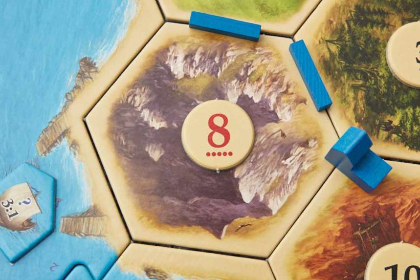

# The Central Limit Theorem
Have you ever played Settlers of Catan? In the game, playes vie over resources and space as they develop thier settlements to try and gather the most victory points. To gather resourses, the players roll two six-sided dice. The sum of the dice determines which terrain tiles generate a resource. For example, if a 2 and a 6 are rolled, then all terrain tiles with an 8 on them would generate a resource that round. As pictured below, every time that the dice sum to 8, an ore will be produced from this tile.

An interesting quirk about this method is that certain sums are more likely to be rolled than other sums. For example, in order to get a 2, a player must roll snake eyes--a 1 with both dice; however, to get a 4, a player can roll either a 2 and a 2, or they could roll a 1 and a 3. You could think of this like having two rows of dice, the first row having a die with face up 1, the next die face up 2, and so on until the final die is face up 6. Then, the second row is backwards: the first die is face up 6, the second die face up 5, and so on until the final die is face up 1. This represents the total number of ways that you could roll a seven: the 1 in the first row lines up with the 6 in the second row, the 2 in the first row lines up with the 5 in the second row, and so on. Thus, there are 6 different ways to roll 2 dice with a sum of 7. The picture below shows the possible ways to roll a 6, along with that probability.

