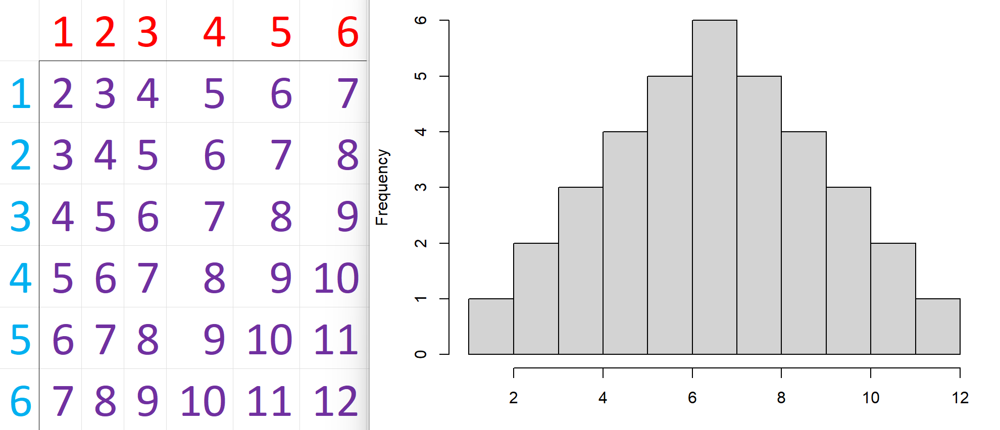

# The Central Limit Theorem
Have you ever played Settlers of Catan? In the game, players vie over resources and space as they develop their settlements to try and win the most victory points. To gather resourses, the players roll two six-sided dice. The sum of the dice determines which terrain tiles generate a resource. For example, if a 2 and a 6 are rolled, then all terrain tiles with an 8 on them would generate a resource that round. As pictured below, every time that the dice sum to 8, an ore will be produced from this tile.

  

The dots below the number 8 denote how frequently the sum should be rolled in the long run. More dots tell the players that the number should be rolled more often, while fewer dots tell the players that the number will be rolled less frequently. Thus, competition is usually fiercest around terrain tiles with the most dots since those terrains will produce resources most frequently. (At least, this is true in in the long run. Anybody that has played this game knows how untrue this seems in a given game).

An interesting quirk about this method is that certain sums are more likely to be rolled than other sums. For example, in order to get a sum of 2, a player must roll snake eyes--both dice must read 1; however, to get a sum of 4, a player can roll either a 2 and a 2, or they could roll a 1 and a 3. You could think of this like having two rows of dice: the first row having a die with face up 1, the next die face up 2, and so on until the final die is face up 6. Then, the second row is backwards: the first die is face up 6, the second die face up 5, and so on until the final die is face up 1. This represents the total number of ways that you could roll a sum of 7: the 1 in the first row lines up with the 6 in the second row, the 2 in the first row lines up with the 5 in the second row, and so on. Thus, there are 6 different ways to roll 2 dice with a sum of 7. The picture below shows the possible ways to roll a sum of 6, along with that probability. You can imagine scooting the bottom row of dice to the right by 1 and finding the probability of the dice summing to 7 as being $\frac{6}{36}$.

  

Below is a two-way table of all the possible rolls with their sums and a histogram to show the frequencies of unique numbers in the table.

Now, consider what will happen if we roll three six-sided dice and then take the sum. Then, there would be only one way to get a sum of 3 (rolling all 1's), and only one way to get a sum of 18 (rolling all 6's). Below is a histogram of what we get after computing all of the possible sums and their frequencies.

What if we roll four dice instead of three?

Now that you get the idea, lets see the histogram where we roll lots of dice and then take the sum from each roll.

As you can see, it looks like our histograms are approaching some shape. The Central Limit Theorem confirms our intution: as the number of dice that we roll increases, we are going to get closer and closer to a normally shapped curve. This is because in order for us to get a sum near the theoretical minimum, we must roll each die near its minimum; however, there are many possible ways to get a sum close to the middle of the distribution: we could roll all the dice in the middle of the distribution, or we could roll half the dice on the high end and the other half on the low end, etc.
